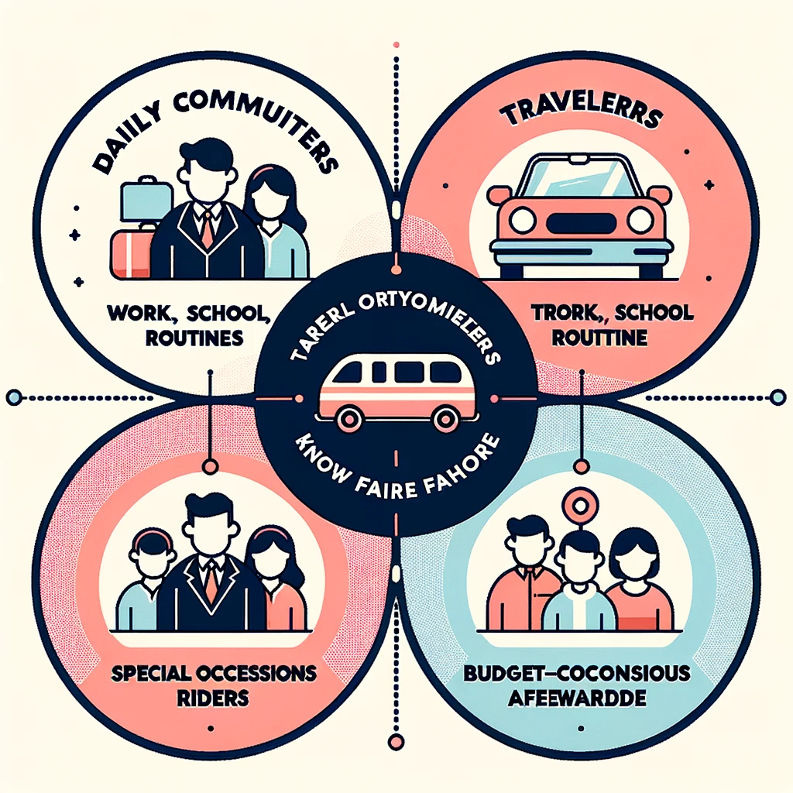

# Ride-Booking Application 🚗

Drawing inspiration from established platforms like Uber, our ride-booking application aims to offer users a seamless and efficient way to book rides on-demand. With a clear differentiation in vehicle options and transparent pricing models, we're here to revolutionize the way you travel!

## Table of Contents

- [Overview](#overview)
- [Scope](#scope)
- [Functionality](#functionality)
- [Target Audience](#target-audience)
- [Conclusion](#conclusion)
- [Contributing](#contributing)
- [License](#license)

## Overview 🌐

The proposed project is intended to provide users with a seamless experience of booking rides by offering various vehicle options and transparent pricing based on the vehicle's size and distance traveled.

## Scope 🛠

- **User-friendly Interface**: Easy sign-up and login processes while ensuring data privacy and security.
- **Vehicle Selection**: Choose from a variety of vehicles ranging from small cars to large SUVs.
- **Dynamic Pricing Model**: Pricing that varies based on the type of vehicle selected and the distance to be traveled.
- **Distance Calculator**: A real-time tool that provides users with an estimate of their destination's distance.
- **Transparent Fare Estimator**: Know the price of your ride before confirming the booking.

## Functionality 🚀

- **User Authentication**: Sign up using an email or phone number and create a password-protected account. For existing users, simply log in to access all features.
- **Vehicle Selection**: Diverse vehicle options tailored to your needs.
- **Dynamic Pricing**: An advanced algorithm to calculate fares.
- **Distance Calculation**: Get estimated distances before booking.
- **Transparent Fare Estimation**: No hidden costs. Ever.
- **Ride Booking**: Confirm your ride with ease.

## Target Audience 👥

- **Daily Commuters**: Those traveling for work, school, or other routines.
- **Travelers**: Tourists or city visitors needing reliable transportation.
- **Special Occasion Travelers**: For special occasions or group travels.
- **Budget-Conscious Riders**: Know your fare before you ride.

## Conclusion 🎯

With a user-centric approach, our ride-booking application promises transparency, efficiency, and flexibility. Catering to a broad audience, we ensure your transportation needs are met with utmost convenience. We're poised to carve a niche in the competitive ride-hailing market with our innovative features.

## Contributing 🤝

Contributions, issues, and feature requests are welcome! See [CONTRIBUTING.md](./CONTRIBUTING.md) for how to contribute.

## License 📄

This project is [MIT](./LICENSE) licensed.

---

❤️ Made with passion for a better ride-booking experience.
